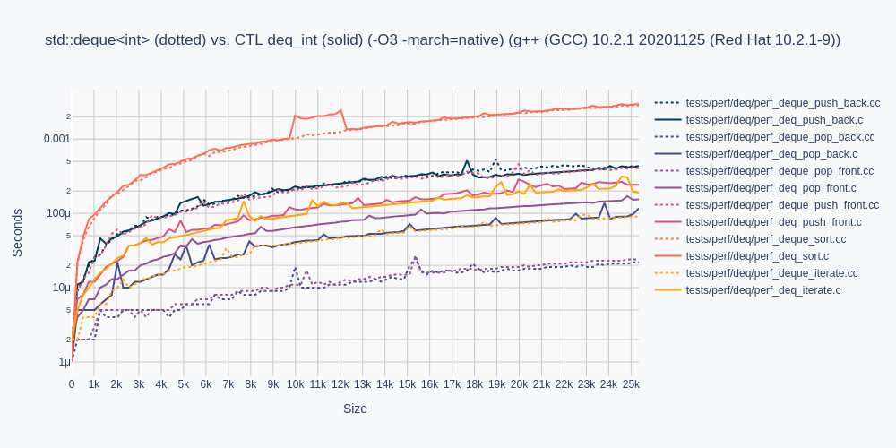

# C CONTAINER TEMPLATE LIBRARY (CTL)

CTL is a fast compiling, type safe, header only, template-like
container library for ISO C99/C11.

## Use

Configure a CTL container with a built-in or typedef type `T`.

```C
    #include <stdio.h>
    
    #define POD
    #define T int
    #include <ctl/vector.h>
    
    int compare(int* a, int* b) { return *b < *a; }
    
    int main(void)
    {
        vec_int a = vec_int_init();
        vec_int_push_back(&a, 9);
        vec_int_push_back(&a, 1);
        vec_int_push_back(&a, 8);
        vec_int_push_back(&a, 3);
        vec_int_push_back(&a, 4);
        vec_int_sort(&a, compare);
        foreach(vec_int, &a, it)
            printf("%d\n", *it.ref);
        vec_int_free(&a);
    }
```

Definition `POD` states type `T` is Plain Old Data (POD).

For a much more thorough getting started guide,
see the wiki: https://github.com/rurban/ctl/wiki and
https://github.com/glouw/ctl/wiki for the original sample with three-letter names.

## Motivation

CTL aims to improve ISO C99/C11 developer productivity by implementing
the following STL containers in ISO C99/C11:

| CTL                                            | = C++ STL            | C prefix |
|:-----------------------------------------------|:---------------------|----------|
| [ctl/deque.h](docs/deque.md)                   | std::deque           | deq      |
| [ctl/list.h](docs/list.md)                     | std::list            | list     |
| [ctl/priority_queue.h](docs/priority_queue.md) | std::priority_queue  | pqu      |
| [ctl/queue.h](docs/queue.md)                   | std::queue           | queue    |
| [ctl/set.h](docs/set.md)                       | std::set             | set      |
| [ctl/stack.h](docs/stack.md)                   | std::stack           | stack    |
| [ctl/string.h](docs/string.md)                 | std::string          | str      |
| [ctl/vector.h](docs/vector.md)                 | std::vector          | vec      |
| [ctl/map.h](docs/map.md)                       | std::map             | map      |
| [ctl/unordered_map.h](docs/unordered_map.md)   | std::unordered_map   | umap     |
| [ctl/unordered_set.h](docs/unordered_set.md)   | std::unordered_set   | uset     |

In work:

[ctl/algorithm.h](docs/algorithm.md),
[ctl/forward_list.h](docs/slist.md),
[ctl/u8string.h](docs/u8string.md),
[ctl/u8ident.h](docs/u8ident.md).

It is based on glouw's ctl, but with proper names, and using the incpath `ctl/` prefix.

## Memory Ownership

Types with memory ownership require definition `POD` be omitted, and require
function declarations for the C++ equivalent of the destructor and copy constructor,
prior to the inclusion of the container:

```C
    typedef struct { ... } type;
    void type_free(type*);
    type type_copy(type*);
    #define T type
    #include <ctl/vector.h>
```

Forgetting a declaration will print a human-readable error message:

```shell
tests/test_c11.c:11:11: error: ‘type_free’ undeclared (first use in this function)
   11 | #define T type
```

## Compare

In contrast to the original CTL, this applies default `compare` and `equal` methods
to all integral types T as
int, long, bool, char, short, float, double, char8_t, wchar_t, char16_t,
char32_t, long double, long long, unsigned int, unsigned long, unsigned char.

Only with structs a `compare` and optionally an `equal` method must be set.
Removed the compare and equal args from `equal`, `sort`, `sort_range`, `find`,
`merge`, `unique`.

Without an `equal` method two `compare` calls are used, so having a special equal
method is preferred if one of those methods from above are used.

If you have a POD type, i.e. a struct with only integral types, i.e. no pointers, you
have to define `NOT_INTEGRAL`.

```C

    #define POD
    #define NOT_INTEGRAL
    #define T point
    #include <ctl/priority_queue.h>
    
    // or
    
    #define T digi
    #include <ctl/deque.h>

    deq_digi a = deq_digi_init();
    a.compare = digi_compare;
    a.equal = digi_equal;
```

Forgetting a compare method will assert with "compare undefined", if enabled.

## Performance

CTL performance is presented in solid colors, and STL in dotted colors,
for template type `T` as type `int` for all measurements.





Omitted from these performance measurements are `queue.h`, `stack.h`, and `string.h`,
as their performance characteristics can be inferred from `deque.h`, and `vector.h`,
respectively. Likewise `map.h` from `set.h` and `unordered_map.h` from
`unordered_set.h`.

`unordered_set.h` is defined with the default `CTL_USET_GROWTH_PRIMED`.
`CTL_USET_GROWTH_POWER2` is here. libstdc++ uses POWER2 by default, libc++
supports both, depending on the initial size.


## Running Tests

To run all functional tests, run:

```shell
make
```

To compile examples, run:

```shell
make examples
```

To generate performance graphs, run:

```shell
make images

# Graphing requires python3 and the Plotly family of libraries via pip3.
pip install plotly
pip install psutil
pip install kaleido
```

To do all of the above in one step, run:

```shell
./all.sh
```

The full CI suite is run via: (1-2 hrs)
```shell
./ci-all.sh
```

To generate the manpages or run `make install` install the `ronn` gem.

For maintaining CTL, a container templated to type `int` can be
output to `stdout` by running make on the container name with .i, eg:

```shell
make ctl/deque.i
make ctl/list.i
make ctl/priority_queue.i
make ctl/queue.i
make ctl/set.i
make ctl/stack.i
make ctl/string.i
make ctl/vector.i
make ctl/map.i
make ctl/unordered_set.i
make ctl/unordered_map.i
make tests/func/test_c11.i
make tests/func/test_list.i
```

## Other

STL variants of multi-sets and multi-maps will not be implemented because
similar behaviour can be implemented as an amalgamation of a `set` and `list`.
See `tests/func/test_container_composing.cc`

UTF-8 strings and identifiers will be added eventually, Wide, UTF-16 or UTF-32
not.

All methods from algorithm, iterator and range are in work.
Implemented are type utilities to omit default compare, equal and hash methods
for POD integral types.

See [Differences](#differences) below.

## Base Implementation Details

```
vector.h:           realloc
string.h:           vector.h
deque.h:            realloc (paged)
queue.h:            deque.h
stack.h:            deque.h
priority_queue.h:   vector.h
list.h:             doubly linked list
forward_list.h:     single linked list
set.h:              red black tree
map.h:              set.h
unordered_set.h:    hashed forward linked lists (will change)
unordered_map.h:    unordered_set.h

                    vec  str  deq  list set  map  pqu  que  stk  uset umap
+------------------------------------------------------------------------+
empty               x    x    x    x    x    x    x    x    x    x    x
each                x    x    x    x    x    x                   x    x
equal               x    x    x    x    x    x    x    x    x    x    x
swap                x    x    x    x    x    x    x    x    x    x    x
load_factor                                                      x    x
max_load_factor                                                  x    x
max_bucket_count                                                 x    x
insert_or_assign                                                 x    x
rehash                                                           x    x
reserve             x    x                                       x    x
insert              x    x    x    x    x    x                   x    x
init                x    x    x    x    x    x    x    x    x    x    x
free                x    x    x    x    x    x    x    x    x    x    x
step                x    x    x    x    x    x                   x    x
range               x    x    x    x    x    x                   x    x
find                x    x    x    x    x    x                   x    x
count                    x              x    x                   x    x
erase               x    x    x    x    x    x                   x    x
copy                x    x    x    x    x    x                   x    x
begin               x    x    x    x    x    x                   x    x
end                 x    x    x    x    x    x                   x    x
intersection                            x    x                   x    x
union                                   x    x                   x    x
difference                              x    x                   x    x
symmetric_difference                    x    x                   x    x
contains                                x    x                   x    x
top                                               x         x
push                                              x    x    x
pop                                               x    x    x
at                  x    x    x
front               x    x    x    x              x
back                x    x    x    x              x
set                 x    x    x
pop_back            x    x    x    x
pop_front                     x    x
clear               x    x    x    x    x
push_back           x    x    x    x
push_front                    x    x
transfer                           x
disconnect                         x
connect                            x
assign              x    x    x    x
resize              x    x    x    x
reverse                            x
shrink_to_fit       x    x
data                x    x
erase_node                              x
sort                x    x    x    x
remove_if           x    x    x    x    x
splice                             x
merge                              x
unique                             x
append                   x
insert_str               x
replace                  x              x
c_str                    x
find                     x
rfind                    x
find_first_of            x
find_last_of             x
find_first_not_of        x
find_last_not_of         x
substr                   x
compare                  x
key_compare              x
```

## Differences

### Differences to the original https://github.com/glouw/ctl

`#include` with the `ctl/` prefix.

Use the original long names, not three-letter abbrevations.

`#define POD` not `P`
`#define NOT_INTEGRAL` not `COMPARE`

Added lots of missing methods, like `max_size`, `size`, `capacity`, ...
Probe for -std=c++20 c++ support and use this for testing against the STL.

Added **map** and **unordered_map**.

Added docs and manpages.

Added builtin default `compare` and `equal` methods for the simple integral types T:
`int`, `long`, `bool`, `char`, `short`, `float`, `double`, `char8_t`, 
`long double`, `long long`, `unsigned int`, `unsigned long`, `unsigned char`.
Only with structs a compare and optionally and equal method must be set.
Removed the compare and equal args from `equal`, `sort`, `sort_range`, `find`,
`merge`, `unique`
Added compare and equal fields to all.

Added many `_it` and `_range` method variants to accept iterators, `_found` to
return found or not.

    deque: insert_it, insert_range, insert_count, erase_it, erase_range,
           emplace, emplace_back, emplace_front, sort_range
    vector: assign_range, erase_it, erase_range
    list: remove, emplace, emplace_front, insert_range, insert_count
    set: erase_it, erase_range
    map: insert_or_assign
    umap: insert_or_assign, insert_or_assign_found
    uset: clear, insert_found

vector `swap` does `shrink_to_fit` as in the STL.

Added many return values as iterators, as in the STL.

Reproducible tests with `SEED=n`,
Optimized test dependencies, time went from 25s to 3s even with ccache.

Optimized hashmaps with two growth policies, about 100x faster with the policy
`CTL_USET_GROWTH_POWER2`, instead of the default `CTL_USET_GROWTH_PRIMED`.

hashmaps will be changed from chained lists to open addressing, thus no internal
bucket methods, and even more faster, but pointers into it are disallowed.
The `CTL_USET_CACHED_HASH` policy is still in work, for faster finds but more memory.

Optimized list, seperate connect before and after methods.

Implemented correct short string and vector capacity policies, as in gcc
libstdc++ and llvm libc++.

Work is ongoing for all `algorithms.h` and `ranges`, with full iterator support
and `foreach_range`.

On errors, like `size > max_size` return silently. This avoids DDOS attacks.
When assert is used, throw them. (when assert.h included, no NDEBUG)

glouw/ctl does not treat errors at all. There cannot be any.

Support not only GNU make, but also BSD make.

### Differences to the STL

STL multiset and multimap variants will not be implemented because
similar behaviour can be implemented as an amalgamation of a `set` and `list`.

STL array and span is missing. array is just a vector.

STL methods returning a pair of iterator and bool have a `_found` suffix,
return the iterator and set a `int *foundp` value. Eg.

    int found;
    map_T_insert_assign_found (self, key, &found);

`emplace`, `erase_if` and many algorithms still missing, most C++20 methods
also still missing.

hashmaps will not rely on chained lists with buckets, and will be either changed
to open addressing or a better modern layout, such greg7mdp/parallel-hashmap.
Thus the bucket interface methods will go, except maybe `max_bucket_count`.

**u8string** will get proper utf-8/unicode support, exceeding C++ STL.
compare will check u8strings normalized to NFD.
No wstring, u16string and u32string (most likely).

**u8ident**: POSIX std extension for people using utf-8 identifiers, but
need security. See http://unicode.org/reports/tr39/
Like a kernel filesystem or user database or programming language
in a UTF-8 terminal, UI widget or editor wishes to present identifiers, like
names, paths or files identifiable.
I.e. normalized and with identifiable characters only. Most don't display
names as puny-code as webbrowers or email clients.
Implement the **Moderately Restrictive** restriction level for identifiers as default.

* All characters in the string are in the ASCII range, or
* The string is single-script, according to the definition in TR39 Section 5.1, or
* The string is covered by any of the following sets of scripts, according to
  the definition in TR39 Section 5.1:
     Latin + Han + Hiragana + Katakana; or equivalently: Latn + Jpan
     Latin + Han + Bopomofo; or equivalently: Latn + Hanb
     Latin + Han + Hangul; or equivalently: Latn + Kore, or
* The string is covered by Latin and any one other Recommended script, except Cyrillic, Greek.
* The string must be validated UTF-8 and normalized, and only consist of valid identifier
  characters.
Reject violations, optionally warn about confusables.

No exceptions or errors. Just ignore or return NULL. If assert is included, use
it, with a proper error message.
No bloat and not many indirect calls (only compare and equal).

Not yet implemented:

    foreach_range
    foreach_n C++17
    foreach_n_range C++20
    mismatch
    mismatch_range C++20
    find_end
    find_end_range C++20
    find_first_of
    find_first_of_range C++20
    adjacent_find
    adjacent_find_range C++20
    search
    search_range C++20
    search_n
    search_n_range C++20
    copy_range C++20
    copy_if C++11
    copy_if_range C++20
    copy_n C++11
    copy_n_range C++20
    copy_backward
    copy_backward_range C++20
    move C++11
    move_range
    move_backward C++11
    move_backward_range C++20
    fill
    fill_range C++20
    fill_n
    fill_n_range C++20
    transform
    transform_range C++20
    generate
    generate_range C++20

## Acknowledgements

Thank you `glouw` for the initial three-letter variant https://github.com/glouw/ctl.

Thank you `kully` for the Plotly code, and thank you for the general review.

Thank you `smlckz` for the `foreach` cleanup.
