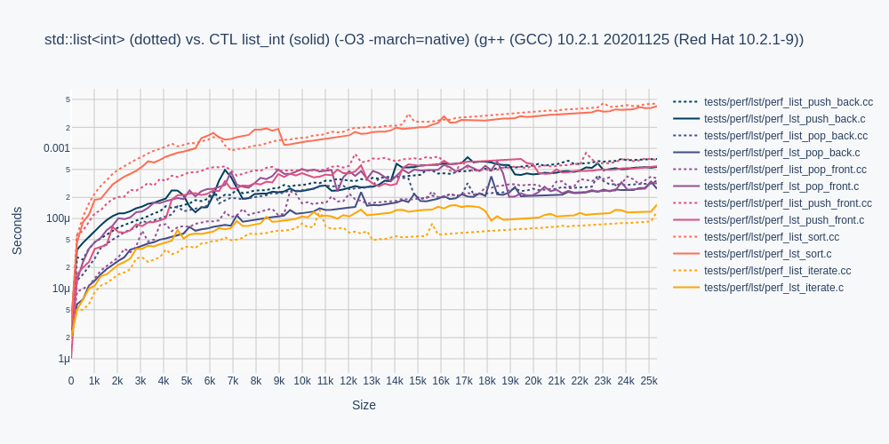
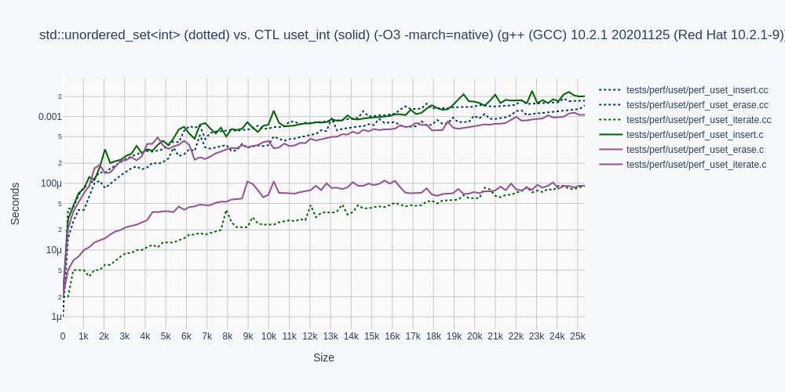
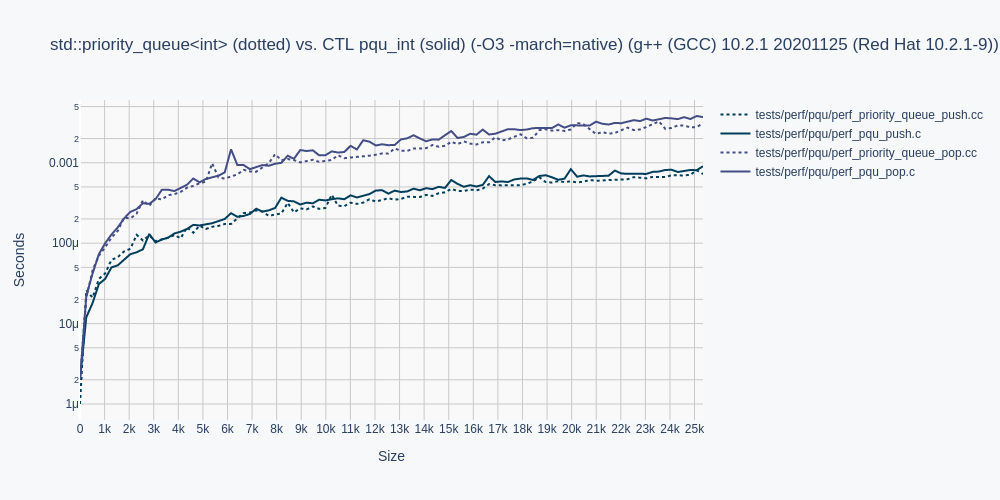
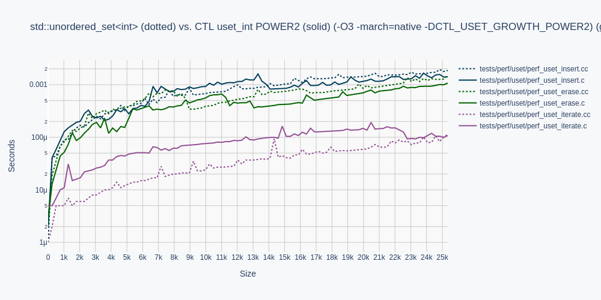
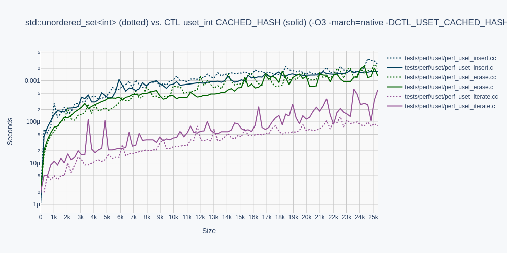

# C CONTAINER TEMPLATE LIBRARY (CTL)

CTL is a fast compiling, type safe, header only, template-like
container library for ISO C99/C11.

## Use

Configure a CTL container with a built-in or typedef type `T`.

```C
    #include <stdio.h>
    
    #define POD
    #define T int
    #include <ctl/vector.h>
    
    int compare(int* a, int* b) { return *b < *a; }
    
    int main(void)
    {
        vec_int a = vec_int_init();
        vec_int_push_back(&a, 9);
        vec_int_push_back(&a, 1);
        vec_int_push_back(&a, 8);
        vec_int_push_back(&a, 3);
        vec_int_push_back(&a, 4);
        vec_int_sort(&a, compare);
        foreach(vec_int, &a, it)
            printf("%d\n", *it.ref);
        vec_int_free(&a);
    }
```

Definition `POD` states type `T` is Plain Old Data (POD).

For a much more thorough getting started guide,
see the wiki: https://github.com/rurban/ctl/wiki and
https://github.com/glouw/ctl/wiki for the original sample with three-letter names.

## Motivation

CTL aims to improve ISO C99/C11 developer productivity by implementing
the following STL containers in ISO C99/C11:

| CTL                                            | = C++ STL            | C prefix |
|:-----------------------------------------------|:---------------------|----------|
| [ctl/deque.h](docs/deque.md)                   | std::deque           | deq      |
| [ctl/list.h](docs/list.md)                     | std::list            | list     |
| [ctl/priority_queue.h](docs/priority_queue.md) | std::priority_queue  | pqu      |
| [ctl/queue.h](docs/queue.md)                   | std::queue           | queue    |
| [ctl/set.h](docs/set.md)                       | std::set             | set      |
| [ctl/stack.h](docs/stack.md)                   | std::stack           | stack    |
| [ctl/string.h](docs/string.md)                 | std::string          | str      |
| [ctl/vector.h](docs/vector.md)                 | std::vector          | vec      |
| [ctl/array.h](docs/array.md)                   | std::array           | arrNNNN  |
| [ctl/map.h](docs/map.md)                       | std::map             | map      |
| [ctl/unordered_map.h](docs/unordered_map.md)   | std::unordered_map   | umap     |
| [ctl/unordered_set.h](docs/unordered_set.md)   | std::unordered_set   | uset     |
|------------------------------------------------|----------------------|
| [ctl/algorithm.h](docs/algorithm.md)           | `<algorithm>`        |

In work:

[ctl/forward_list.h](docs/slist.md),
[ctl/u8string.h](docs/u8string.md),
[ctl/u8ident.h](docs/u8ident.md), and better iterators.

It is based on glouw's ctl, but with proper names, and using the incpath `ctl/` prefix.

## Memory Ownership

Types with memory ownership require definition `POD` be omitted, and require
function declarations for the C++ equivalent of the destructor and copy constructor,
prior to the inclusion of the container:

```C
    typedef struct { ... } type;
    void type_free(type*);
    type type_copy(type*);
    #define T type
    #include <ctl/vector.h>
```

Forgetting a declaration will print a human-readable error message:

```shell
tests/test_c11.c:11:11: error: ‘type_free’ undeclared (first use in this function)
   11 | #define T type
```

## Compare

In contrast to the original CTL, this applies default `compare` and `equal` methods
to all integral types T as `int`, `long`, `bool`, `char`, `short`, `float`, `double`, `char8_t`,
`uint8_t` - `uin64_t`, `int8_t` - `in64_t`.
Since T may not contain a space, we also accept `long double` as `ldbl`,
`long long` as `llong`, `unsigned int` as `uint` and `uint8_t` - `uin64_t`,
`unsigned long` as `ulong`, `unsigned char` as `uchar`.

Only with structs a `compare` and optionally an `equal` method must be set.
Removed the compare and equal args from `equal`, `sort`, `sort_range`, `find`,
`merge`, `unique`.

Without an `equal` method two `compare` calls are used, so having a special equal
method is preferred if one of those methods from above are used.

If you have a POD type, i.e. a struct with only integral types, i.e. no pointers, you
have to define `NOT_INTEGRAL`.

```C

    #define POD
    #define NOT_INTEGRAL
    #define T point
    #include <ctl/priority_queue.h>
    
    // or
    
    #define T digi
    #include <ctl/deque.h>

    deq_digi a = deq_digi_init();
    a.compare = digi_compare;
    a.equal = digi_equal;
```

Forgetting a compare method will assert with "compare undefined", if enabled.

## Iterators and Ranges

The special iterator objects created by `begin`, `end` and returned by `next`,
`advance` return the positions, but have more iterator specific fields contained
within.

Previous versions of the ctl (_with version numbers < 2020_) had different heavy
and incompatible iterators, initialized by `each`. Our iterators are as in the
STL initialized with `begin` or `end`, and for ranges with `range`.  Now the
iterator contains the value or node ref, and nothing else.  Now they are
compatible with the STL and are even faster than them.

See [iterators](docs/iterators.md).

Range methods are suffixed with `_range`.

## Performance

CTL performance is presented in solid colors, and STL in dotted colors,
for template type `T` as type `int` for all measurements.









Omitted from these performance measurements are `queue.h` and `stack.h`,
as their performance characteristics can be inferred from `deque.h`.
Likewise `map.h` from `set.h` and `unordered_map.h` from `unordered_set.h`.

`unordered_set.h` is defined with the default `CTL_USET_GROWTH_PRIMED`.
libstdc++ uses POWER2 by default, libc++ supports both, depending on the initial size.
`CTL_USET_GROWTH_POWER2` is here:



`CTL_USET_CACHED_HASH` is here:



This trades memory for faster unsuccessful searches, such as with insert with
high load factor.

## Running Tests

To run all functional tests, run:

```shell
make
```

To compile examples, run:

```shell
make examples
```

To generate performance graphs, run:

```shell
make images

# Graphing requires python3 and the Plotly family of libraries via pip3.
pip install plotly
pip install psutil
pip install kaleido
```

To do all of the above in one step, run:

```shell
./all.sh
```

The full CI suite is run via: (1-2 hrs)
```shell
./ci-all.sh
```

To generate the manpages or run `make install` install the `ronn` gem.

For maintaining CTL, a container templated to type `int` can be
output to `stdout` by running make on the container name with .i, eg:

```shell
make ctl/deque.i
make ctl/list.i
make ctl/priority_queue.i
make ctl/queue.i
make ctl/set.i
make ctl/stack.i
make ctl/string.i
make ctl/vector.i
make ctl/array.i
make ctl/map.i
make ctl/unordered_set.i
make ctl/unordered_map.i
make tests/func/test_c11.i
make tests/func/test_list.i
```

## Other

STL variants of multi-sets and multi-maps will not be implemented because
similar behaviour can be implemented as an amalgamation of a `set` and `list`.
See `tests/func/test_container_composing.cc`

UTF-8 strings and identifiers will be added eventually, Wide, UTF-16 or UTF-32
not. Parallel variants of all containers and algos in `pctl` with openmp are in
planning.

Many methods from algorithm, with iterators and range are now implemented, with
iterators changed from upstream.
Also implemented are type utilities to omit default compare, equal and hash methods
for POD integral types.

See [Differences](#differences) below.

The other header-only STL variant in C is [pottery](https://github.com/ludocode/pottery),
which also sucks less and also fairly complete and decent.
More STL attempts in C are [glib](http://suckless.org/sucks/), and
partially [libmowgli](https://github.com/atheme/libmowgli-2),
[libulz](https://github.com/rofl0r/libulz).

## Base Implementation Details


    array.h:            stack/heap allocated
    vector.h:           realloc
    string.h:           vector.h
    deque.h:            realloc (paged)
    queue.h:            deque.h
    stack.h:            deque.h
    priority_queue.h:   vector.h
    list.h:             doubly linked list
    forward_list.h:     single linked list
    set.h:              red black tree
    map.h:              set.h
    unordered_set.h:    hashed forward linked lists
    unordered_map.h:    unordered_set.h (without pair convenience yet)

    ✓  stable and tested
    x  implemented, but broken or untested
       not yet implemented
    -  unspecified, unsupported


|                                 |vec |str |arr |deq |list|set |map |uset|umap|pqu |que |stk |
|---------------------------------|----|----|----|----|----|----|----|----|----|----|----|----|
|`init`                           | ✓  | ✓  | ✓  | ✓  | ✓  | ✓  | ✓  | ✓  | ✓  | ✓  | ✓  | ✓  |
|`init_from`                      | ✓  | ✓  | ✓  | ✓  | ✓  | ✓  | ✓  | ✓  | ✓  | ✓  | ✓  | ✓  |
|`free`                           | ✓  | ✓  | ✓  | ✓  | ✓  | ✓  | ✓  | ✓  | ✓  | ✓  | ✓  | ✓  |
|`copy`                           | ✓  | ✓  | ✓  | ✓  | ✓  | ✓  | ✓  | ✓  | x  |    |    |    |
|`size`                           | ✓  | ✓  | ✓  | ✓  | ✓  | ✓  | ✓  | ✓  | ✓  | ✓  | ✓  | ✓  |
|`max_size`                       | ✓  | ✓  | ✓  | ✓  | ✓  | ✓  | ✓  | ✓  | ✓  | ✓  | ✓  | ✓  |
|`empty`                          | ✓  | ✓  | ✓  | ✓  | ✓  | ✓  | ✓  | ✓  | ✓  | ✓  | ✓  | ✓  |
|`equal`                          | ✓  | ✓  | ✓  | ✓  | ✓  | ✓  | ✓  | ✓  | ✓  | ✓  | ✓  | ✓  |
|`insert`                         | ✓  | ✓  | -  | ✓  | ✓  | ✓  | ✓  | ✓  | ✓  | -  | -  | -  |
|`insert_index`                   | ✓  | ✓  | -  | ✓  | -  | -  | -  | -  | -  | -  | -  | -  |
|`insert_count`                   | ✓  | ✓  | -  | ✓  | ✓  | -  | -  | -  | -  | -  | -  | -  |
|`insert_range`                   | ✓  | ✓  | -  | ✓  | ✓  | ✓  |    | -  | -  | -  | -  | -  |
|`insert_found`                   | -  | -  | -  | -  | -  | ✓  |    | ✓  | ✓  | -  | -  | -  |
|`insert_or_assign`               | -  | -  | -  | -  | -  | -  | ✓  | -  | ✓  | -  | -  | -  |
|`insert_or_assign_found`         | -  | -  | -  | -  | -  | -  |    | -  | ✓  | -  | -  | -  |
|`load_factor`                    | -  | -  | -  | -  | -  | -  | -  | ✓  | ✓  | -  | -  | -  |
|`max_load_factor`                | -  | -  | -  | -  | -  | -  | -  | ✓  | ✓  | -  | -  | -  |
|`max_bucket_count`               | -  | -  | -  | -  | -  | -  | -  | ✓  | ✓  | -  | -  | -  |
|`bucket_size`                    | -  | -  | -  | -  | -  | -  | -  | ✓  | ✓  | -  | -  | -  |
|`rehash`                         | -  | -  | -  | -  | -  | -  | -  | ✓  | ✓  | -  | -  | -  |
|`emplace`                        | x  |    | -  | ✓  | ✓  | x  | -  | ✓  | x  | ✓  | -  | -  |
|`emplace_front`                  | -  | -  | -  | ✓  | ✓  | -  | -  | -  | -  | -  | -  | -  |
|`emplace_back`                   | ✓  | -  | -  | ✓  | ✓  | -  | -  | -  | -  | -  | -  | -  |
|`emplace_hint`                   | -  | -  | -  | -  | -  |    |    | ✓  | x  | -  | -  | -  |
|`reserve`                        | ✓  | ✓  | -  | -  | -  | -  | -  | ✓  | ✓  | -  | -  | -  |
|`find`                           | ✓  | ✓  | ✓  | ✓  | ✓  | ✓  | ✓  | ✓  | ✓  | -  | -  | -  |
|`erase`                          | ✓  | ✓  | -  | ✓  | ✓  | ✓  | ✓  | ✓  | ✓  | -  | -  | -  |
|`erase_if`                       | ✓  |    | -  | ✓  | ✓  | ✓  | x  | ✓  | ✓  | -  | -  | -  |
|`erase_index`                    | ✓  | ✓  | -  | ✓  | -  | -  | -  | -  | -  | -  | -  | -  |
|`erase_node`                     | -  | -  | -  | -  | ✓  | ✓  |    |    |    | -  | -  | -  |
|`erase_range`                    | ✓  |    | -  | ✓  | ✓  | ✓  |    | -  | -  | -  | -  | -  |
|`top`                            | -  | -  | -  | -  | -  | -  | -  | -  | -  | ✓  |    | ✓  |
|`push`                           | -  | -  | -  | -  | -  | -  | -  | -  | -  | ✓  | ✓  | ✓  |
|`pop`                            | -  | -  | -  | -  | -  | -  | -  | -  | -  | ✓  | ✓  | ✓  |
|`at`                             | -  | -  | -  | -  | -  | -  | -  | -  | -  | -  | -  | -  |
|`front`                          | -  | -  | -  | -  | -  | -  | -  | -  | -  | -  | -  | -  |
|`back`                           | -  | -  | -  | -  | -  | -  | -  | -  | -  | -  | -  | -  |
|`set`                            |    |    |    |    |    |    |    |    |    | -  | -  | -  |
|`pop_back`                       | ✓  | ✓  | -  | ✓  | ✓  | -  | -  | -  | -  | -  | -  | -  |
|`pop_front`                      | -  | -  | -  | ✓  | ✓  | -  | -  | -  | -  | -  | -  | -  |
|`push_back`                      | ✓  | ✓  | -  | ✓  | ✓  | -  | -  | -  | -  | -  | -  | -  |
|`push_front`                     | -  | -  | -  | ✓  | ✓  | -  | -  | -  | -  | -  | -  | -  |
|`clear`                          | ✓  | ✓  |    | ✓  | ✓  | ✓  | ✓  | ✓  | ✓  | -  | -  | -  |
|`assign`                         | ✓  | ✓  | ✓  | ✓  | ✓  |    |    |    |    | -  | -  | -  |
|`resize`                         | ✓  | ✓  | -  | ✓  | ✓  | -  | -  | -  | -  | -  | -  | -  |
|`shrink_to_fit`                  | ✓  | ✓  | -  | ✓  | -  | -  | -  | -  | -  | -  | -  | -  |
|`data`                           |    |    |    | -  | -  | -  | -  | -  | -  | -  | -  | -  |
|`splice`                         | -  | -  | -  | -  | ✓  | -  | -  | -  | -  | -  | -  | -  |
|`splice_it`                      | -  | -  | -  | -  | ✓  | -  | -  | -  | -  | -  | -  | -  |
|`splice_range`                   | -  | -  | -  | -  | ✓  | -  | -  | -  | -  | -  | -  | -  |
|`contains`                       |    |    |    |    |    | ✓  | x  | ✓  | ✓  | -  | -  | -  |
|`append`                         | -  | ✓  | -  | -  | -  | -  | -  | -  | -  | -  | -  | -  |
|`insert_str`                     | -  |    | -  | -  | -  | -  | -  | -  | -  | -  | -  | -  |
|`c_str`                          | -  | ✓  | -  | -  | -  | -  | -  | -  | -  | -  | -  | -  |
|`find`                           | ✓  | ✓  | ✓  | ✓  | ✓  | ✓  | ✓  | ✓  | ✓  | -  | -  | -  |
|`rfind`                          | -  | ✓  | -  | -  | -  | -  | -  | -  | -  | -  | -  | -  |
|`find_last_of`                   | -  | ✓  | -  | -  | -  | -  | -  | -  | -  | -  | -  | -  |
|`find_first_not_of`              | -  | ✓  | -  | -  | -  | -  | -  | -  | -  | -  | -  | -  |
|`find_last_not_of`               | -  | ✓  | -  | -  | -  | -  | -  | -  | -  | -  | -  | -  |
|`substr`                         | -  | ✓  | -  | -  | -  | -  | -  | -  | -  | -  | -  | -  |
|`compare`                        | -  | ✓  | -  | -  | -  | -  | -  | -  | -  | -  | -  | -  |
|`key_compare`                    | -  | ✓  | -  | -  | -  | -  |    | -  |    | -  | -  | -  |
|---------------------------------|----|----|----|----|----|----|----|----|----|----|----|----|
|                                 |vec |str |arr |deq |list|set |map |uset|umap|pqu |que |stk |
|---------------------------------|----|----|----|----|----|----|----|----|----|----|----|----|
|`begin`                          | ✓  | ✓  | ✓  | ✓  | ✓  | ✓  | ✓  | ✓  | ✓  | -  | -  | -  |
|`end`                            | ✓  | ✓  | ✓  | ✓  | ✓  | ✓  | ✓  | ✓  | ✓  | -  | -  | -  |
|`next`                           | ✓  | ✓  | ✓  | ✓  | ✓  | ✓  | ✓  | ✓  | ✓  | -  | -  | -  |
|`done`                           | ✓  | ✓  | ✓  | ✓  | ✓  | ✓  | ✓  | ✓  | ✓  | -  | -  | -  |
|`set_done`                       | ✓  | ✓  | ✓  | ✓  | ✓  | ✓  | ✓  | ✓  | ✓  | -  | -  | -  |
|`set_end`                        | ✓  | ✓  | ✓  | ✓  | ✓  | ✓  | ✓  | ✓  | ✓  | -  | -  | -  |
|`iter`                           | ✓  | ✓  | ✓  | ✓  | ✓  | ✓  | ✓  | ✓  | ✓  | -  | -  | -  |
|`ref`                            | ✓  | ✓  | ✓  | ✓  | ✓  | ✓  | ✓  | ✓  | ✓  | -  | -  | -  |
|`prev`                           | ✓  | ✓  | ✓  | ✓  | ✓  | ✓  | ✓  | -  | -  | -  | -  | -  |
|`distance`                       | ✓  | ✓  | ✓  | ✓  | ✓  | ✓  | ✓  | -  | -  | -  | -  | -  |
|`index`                          | ✓  | ✓  | ✓  | ✓  | ✓  | ✓  | ✓  | -  | -  | -  | -  | -  |
|`advance_end`                    | ✓  | ✓  | ✓  | ✓  | ✓  | ✓  | ✓  | -  | -  | -  | -  | -  |
|`distance`                       | ✓  | ✓  | ✓  | ✓  | ✓  | ✓  | ✓  | -  | -  | -  | -  | -  |
|`range`                          | ✓  | ✓  | ✓  | ✓  | ✓  | ✓  | ✓  | -  | -  | -  | -  | -  |
|---------------------------------|----|----|----|----|----|----|----|----|----|----|----|----|
|                                 |vec |str |arr |deq |list|set |map |uset|umap|pqu |que |stk |
|---------------------------------|----|----|----|----|----|----|----|----|----|----|----|----|
|`all_of`                         | ✓  | ✓  | ✓  | ✓  | ✓  | ✓  | x  | ✓  | x  | -  | -  | -  |
|`any_of`                         | ✓  | ✓  | ✓  | ✓  | ✓  | ✓  | x  | ✓  | x  | -  | -  | -  |
|`none_of`                        | ✓  | ✓  | ✓  | ✓  | ✓  | ✓  | x  | ✓  | x  | -  | -  | -  |
|`all_of_range`                   | ✓  | ✓  | ✓  | ✓  | ✓  | ✓  | x  | -  | -  | -  | -  | -  |
|`any_of_range`                   | ✓  | ✓  | ✓  | ✓  | ✓  | ✓  | x  | -  | -  | -  | -  | -  |
|`none_of_range`                  | ✓  | ✓  | ✓  | ✓  | ✓  | ✓  | x  | -  | -  | -  | -  | -  |
|`foreach`                        | ✓  | ✓  | ✓  | ✓  | ✓  | ✓  | ✓  | ✓  | ✓  | -  | -  | -  |
|`foreach_range`                  | ✓  | ✓  | ✓  | ✓  | ✓  | ✓  | ✓  | -  | -  | -  | -  | -  |
|`foreach_n`                      | ✓  | ✓  | ✓  | ✓  | ✓  | ✓  | ✓  | -  | -  | -  | -  | -  |
|`foreach_n_range`                | ✓  | ✓  | ✓  | ✓  | ✓  | ✓  | ✓  | -  | -  | -  | -  | -  |
|`count`                          | ✓  | ✓  | ✓  | ✓  | ✓  | ✓  | ✓  | ✓  | ✓  | -  | -  | -  |
|`count_range`                    | ✓  | ✓  | ✓  | ✓  | ✓  | ✓  | x  | -  | -  | -  | -  | -  |
|`count_if`                       | ✓  | ✓  | ✓  | ✓  | ✓  | ✓  | x  | ✓  | x  | -  | -  | -  |
|`count_if_range`                 | ✓  | ✓  | ✓  | ✓  | ✓  | ✓  | x  | -  | -  | -  | -  | -  |
|`mismatch`                       | ✓  | ✓  | ✓  | ✓  | ✓  | ✓  |    | -  | -  | -  | -  | -  |
|`find_if`                        | ✓  |    | ✓  | ✓  | ✓  | ✓  | x  | ✓  | x  | -  | -  | -  |
|`find_if_not`                    | ✓  |    | ✓  | ✓  | ✓  | ✓  | x  | ✓  | x  | -  | -  | -  |
|`find_range`                     | ✓  | ✓  | ✓  | ✓  | ✓  | ✓  | x  | -  | -  | -  | -  | -  |
|`find_if_range`                  | ✓  | ✓  | ✓  | ✓  | ✓  | ✓  | x  | -  | -  | -  | -  | -  |
|`find_if_not_range`              | ✓  | ✓  | ✓  | ✓  | ✓  | ✓  | x  | -  | -  | -  | -  | -  |
|`find_end`                       | ✓  |    | ✓  | ✓  | ✓  | ✓  |    | -  | -  | -  | -  | -  |
|`find_end_range`                 | ✓  |    | ✓  | ✓  | ✓  | ✓  |    | -  | -  | -  | -  | -  |
|`find_first_of`                  | ✓  | ✓  | ✓  | ✓  | ✓  | ✓  |    |    |    | -  | -  | -  |
|`find_first_of_range`            | ✓  | ✓  | ✓  | ✓  | ✓  | ✓  |    | -  | -  | -  | -  | -  |
|`adjacent_find`                  | ✓  | ✓  | ✓  | ✓  | ✓  | ✓  |    | -  | -  | -  | -  | -  |
|`adjacent_find_range`            | ✓  | ✓  | ✓  | ✓  | ✓  | ✓  |    | -  | -  | -  | -  | -  |
|`search`                         | ✓  | ✓  | ✓  | ✓  | ✓  | ✓  |    | -  | -  | -  | -  | -  |
|`search_range`                   | ✓  | ✓  | ✓  | ✓  | ✓  | ✓  |    | -  | -  | -  | -  | -  |
|`search_n`                       |    |    |    |    |    |    |    | -  | -  | -  | -  | -  |
|`search_n_range`                 |    |    |    |    |    |    |    | -  | -  | -  | -  | -  |
|`copy_range`                     | ✓  | ✓  | -  | ✓  | ✓  |    |    | -  | -  | -  | -  | -  |
|`copy_if`                        |    |    |    |    |    |    |    |    |    | -  | -  | -  |
|`copy_if_range`                  |    |    |    |    |    |    |    | -  | -  | -  | -  | -  |
|`copy_n`                         |    |    |    |    |    |    |    |    |    | -  | -  | -  |
|`copy_n_range`                   |    |    |    |    |    |    |    | -  | -  | -  | -  | -  |
|`copy_backward`                  |    |    |    |    |    |    |    |    |    | -  | -  | -  |
|`copy_backward_range`            |    |    |    |    |    |    |    | -  | -  | -  | -  | -  |
|`move`                           |    |    |    |    |    |    |    |    |    | -  | -  | -  |
|`move_range`                     |    |    |    |    |    |    |    | -  | -  | -  | -  | -  |
|`move_backward`                  |    |    |    |    |    |    |    |    |    | -  | -  | -  |
|`move_backward_range`            |    |    |    |    |    |    |    | -  | -  | -  | -  | -  |
|`fill`                           |    |    | ✓  |    |    |    |    | -  | -  | -  | -  | -  |
|`fill_range`                     |    |    |    |    |    |    |    | -  | -  | -  | -  | -  |
|`fill_n`                         |    |    | ✓  |    |    |    |    | -  | -  | -  | -  | -  |
|`fill_n_range`                   |    |    |    |    |    |    |    | -  | -  | -  | -  | -  |
|`transform`                      | ✓  | ✓  | ✓  | ✓  | ✓  | ✓  |    | ✓  | x  | -  | -  | -  |
|`transform_it`                   | ✓  | ✓  | ✓  | ✓  | x  | ✓  |    |    |    | -  | -  | -  |
|`transform_range`                | x  | x  | x  | ✓  | x  | ✓  |    | -  | -  | -  | -  | -  |
|`transform_it_range`             | x  |    |    | ✓  |    | ✓  |    | -  | -  | -  | -  | -  |
|`generate`                       | ✓  | ✓  | ✓  | ✓  | ✓  | ✓  |    | ✓  | x  | -  | -  | -  |
|`generate_range`                 | ✓  | ✓  | ✓  | ✓  | ✓  | x  |    | -  | -  | -  | -  | -  |
|`generate_n`                     | ✓  | ✓  | ✓  | ✓  | ✓  | ✓  |    | ✓  |    | -  | -  | -  |
|`generate_n_range`               | x  | x  | x  | ✓  | x  | ✓  |    | -  | -  | -  | -  | -  |
|`remove`                         |    |    |    |    | ✓  |    |    |    |    | -  | -  | -  |
|`remove_if`                      | ✓  |    |    | ✓  | ✓  | ✓  |    | x  | x  | -  | -  | -  |
|`remove_copy`                    |    |    |    |    |    |    |    |    |    | -  | -  | -  |
|`remove_copy_if`                 |    |    |    |    |    |    |    |    |    | -  | -  | -  |
|`remove_copy_range`              |    |    |    |    |    |    |    | -  | -  | -  | -  | -  |
|`remove_copy_if_range`           |    |    |    |    |    |    |    | -  | -  | -  | -  | -  |
|`replace`                        |    | ✓  |    |    |    |    |    |    |    | -  | -  | -  |
|`replace_if`                     |    |    |    |    |    |    |    |    |    | -  | -  | -  |
|`replace_range`                  |    |    |    |    |    |    |    | -  | -  | -  | -  | -  |
|`replace_if_range`               |    |    |    |    |    |    |    | -  | -  | -  | -  | -  |
|`replace_copy`                   |    |    |    |    |    |    |    |    |    | -  | -  | -  |
|`replace_copy_if`                |    |    |    |    |    |    |    |    |    | -  | -  | -  |
|`replace_copy_range`             |    |    |    |    |    |    |    | -  | -  | -  | -  | -  |
|`replace_copy_if_range`          |    |    |    |    |    |    |    | -  | -  | -  | -  | -  |
|`swap`                           | ✓  | ✓  | ✓  | ✓  | ✓  | ✓  | ✓  | ✓  | x  | ✓  | ✓  | ✓  |
|`swap_ranges`                    |    |    |    |    |    |    |    | -  | -  | -  | -  | -  |
|`iter_swap`                      |    |    |    |    |    |    |    | -  | -  | -  | -  | -  |
|`reverse`                        |    |    |    |    | ✓  |    |    | -  | -  | -  | -  | -  |
|`reverse_range`                  |    |    |    |    |    |    |    | -  | -  | -  | -  | -  |
|`reverse_copy`                   |    |    |    |    |    |    |    | -  | -  | -  | -  | -  |
|`reverse_copy_range`             |    |    |    |    |    |    |    | -  | -  | -  | -  | -  |
|`rotate`                         |    |    |    |    |    |    |    | -  | -  | -  | -  | -  |
|`rotate_range`                   |    |    |    |    |    |    |    | -  | -  | -  | -  | -  |
|`rotate_copy`                    |    |    |    |    |    |    |    | -  | -  | -  | -  | -  |
|`rotate_copy_range`              |    |    |    |    |    |    |    | -  | -  | -  | -  | -  |
|`shift_left`                     |    |    |    |    |    |    |    | -  | -  | -  | -  | -  |
|`shift_right`                    |    |    |    |    |    |    |    | -  | -  | -  | -  | -  |
|`shuffle`                        |    |    |    |    |    |    |    | -  | -  | -  | -  | -  |
|`shuffle_range`                  |    |    |    |    |    |    |    | -  | -  | -  | -  | -  |
|`sample`                         |    |    |    |    |    |    |    | -  | -  | -  | -  | -  |
|`sample_range`                   |    |    |    |    |    |    |    | -  | -  | -  | -  | -  |
|`unique`                         | ✓  |    |    |    | ✓  | -  | -  | -  | -  | -  | -  | -  |
|`unique_range`                   | ✓  |    |    |    | x  | -  | -  | -  | -  | -  | -  | -  |
|`unique_copy`                    |    |    |    |    |    | -  | -  | -  | -  | -  | -  | -  |
|`unique_copy_range`              |    |    |    |    |    | -  | -  | -  | -  | -  | -  | -  |
|`is_partitioned`                 |    |    |    |    |    |    |    | -  | -  | -  | -  | -  |
|`is_partitioned_range`           |    |    |    |    |    |    |    | -  | -  | -  | -  | -  |
|`partition`                      |    |    |    |    |    |    |    | -  | -  | -  | -  | -  |
|`partition_range`                |    |    |    |    |    |    |    | -  | -  | -  | -  | -  |
|`partition_copy`                 |    |    |    |    |    |    |    | -  | -  | -  | -  | -  |
|`partition_copy_range`           |    |    |    |    |    |    |    | -  | -  | -  | -  | -  |
|`stable_partition`               |    |    |    |    |    |    |    | -  | -  | -  | -  | -  |
|`stable_partition_range`         |    |    |    |    |    |    |    | -  | -  | -  | -  | -  |
|`partition_point`                |    |    |    |    |    |    |    | -  | -  | -  | -  | -  |
|`partition_point_range`          |    |    |    |    |    |    |    | -  | -  | -  | -  | -  |
|`is_sorted`                      |    |    |    |    |    |    |    | -  | -  | -  | -  | -  |
|`is_sorted_range`                |    |    |    |    |    |    |    | -  | -  | -  | -  | -  |
|`is_sorted_until`                |    |    |    |    |    |    |    | -  | -  | -  | -  | -  |
|`is_sorted_until_range`          |    |    |    |    |    |    |    | -  | -  | -  | -  | -  |
|`sort`                           | ✓  | ✓  | ✓  | ✓  | ✓  | -  | -  | -  | -  | -  | -  | -  |
|`sort_range`                     |    |    |    | ✓  |    | -  | -  | -  | -  | -  | -  | -  |
|`partial_sort`                   |    |    |    |    |    | -  | -  | -  | -  | -  | -  | -  |
|`partial_sort_range`             |    |    |    |    |    | -  | -  | -  | -  | -  | -  | -  |
|`partial_sort_copy`              |    |    |    |    |    | -  | -  | -  | -  | -  | -  | -  |
|`partial_sort_copy_range`        |    |    |    |    |    | -  | -  | -  | -  | -  | -  | -  |
|`stable_sort`                    |    |    |    |    |    | -  | -  | -  | -  | -  | -  | -  |
|`stable_sort_range`              |    |    |    |    |    | -  | -  | -  | -  | -  | -  | -  |
|`nth_element`                    |    |    |    |    |    |    |    | -  | -  | -  | -  | -  |
|`nth_element_range`              |    |    |    |    |    |    |    | -  | -  | -  | -  | -  |
|`lower_bound`                    | x  | x  | x  | x  | x  | x  |    | x  | x  | -  | -  | -  |
|`lower_bound_range`              | x  | x  | x  | x  | x  | x  |    | -  | -  | -  | -  | -  |
|`upper_bound`                    | x  | x  | x  | x  | x  | x  |    | x  | x  | -  | -  | -  |
|`upper_bound_range`              | x  | x  | x  | x  | x  | x  |    | -  | -  | -  | -  | -  |
|`binary_search`                  |    |    |    |    |    |    |    | -  | -  | -  | -  | -  |
|`binary_search_range`            |    |    |    |    |    |    |    | -  | -  | -  | -  | -  |
|`equal_range`                    | x  | x  | x  | x  | x  | x  | x  | -  | -  | -  | -  | -  |
|`equal_range_range`              |    |    |    |    |    |    |    | -  | -  | -  | -  | -  |
|`merge`                          |    |    |    |    | ✓  | x  |    | x  | x  | -  | -  | -  |
|`merge_range`                    |    |    |    |    |    |    |    | -  | -  | -  | -  | -  |
|`inplace_merge`                  |    |    |    |    |    |    |    |    |    | -  | -  | -  |
|`inplace_merge_range`            |    |    |    |    |    |    |    | -  | -  | -  | -  | -  |
|`includes`                       | ✓  |    |    | ✓  | ✓  |    |    | -  | -  | -  | -  | -  |
|`includes_range`                 | ✓  |    |    | ✓  | ✓  |    |    | -  | -  | -  | -  | -  |
|`difference`                     | ✓  | ✓  | x  | ✓  | ✓  | ✓  | ✓  | ✓  | ✓  | -  | -  | -  |
|`intersection`                   | ✓  | ✓  | x  | ✓  | ✓  | ✓  | ✓  | ✓  | ✓  | -  | -  | -  |
|`symmetric_difference`           | ✓  | ✓  | x  | ✓  | ✓  | ✓  | ✓  | ✓  | ✓  | -  | -  | -  |
|`union`                          | ✓  | ✓  | -  | ✓  | ✓  | ✓  | ✓  | ✓  | ✓  | -  | -  | -  |
|`difference_range`               | ✓  | ✓  |    | ✓  | ✓  |    |    | -  | -  | -  | -  | -  |
|`intersection_range`             | ✓  | ✓  |    | ✓  | ✓  |    |    | -  | -  | -  | -  | -  |
|`symmetric_difference_range`     | ✓  | ✓  |    | ✓  | ✓  |    |    | -  | -  | -  | -  | -  |
|`union_range`                    | ✓  | ✓  | -  | ✓  | ✓  |    |    | -  | -  | -  | -  | -  |
|---------------------------------|----|----|----|----|----|----|----|----|----|----|----|----|
|                                 |vec |str |arr |deq |list|set |map |uset|umap|pqu |que |stk |

## Differences

### Differences to the original https://github.com/glouw/ctl

`#include` with the `ctl/` prefix.

Use the original long names, not three-letter abbrevations.

`#define POD` not `P`

`#define NOT_INTEGRAL` not `COMPARE`

Our version number `CTL_VERSION` is greater than 2020 (starting with `202102L`),
the old ctl is lower than 2020, starting with `1.0`.

Added lots of missing methods. We have 657 methods, 130 of them unique.
glouw has 196 methods, 63 of them unique.

Probe for -std=c++20 c++ support and use this for testing against the STL.
Fallback to c++2a, c++17 or c++11.

Added **array**, **map** and **unordered_map** containers.

Added docs and manpages.

Added builtin default `compare` and `equal` methods for the simple integral types T:
`int`, `long`, `bool`, `char`, `short`, `float`, `double`, `char8_t`,
`long double`, `long long`, `unsigned int`, `unsigned long`, `unsigned char`.
Only with structs a compare and optionally and equal method must be set.
Removed the compare and equal args from `equal`, `sort`, `sort_range`, `find`,
`merge`, `unique`
Added compare and equal fields to all.

Added many `_it` and `_range` method variants to accept iterator pairs or single
ranges, `_found` to return found or not.
Methods working on iterators don't need the container arg `(A* self)`.

    deque:  insert_range, insert_count, erase_range,
            emplace, emplace_back, emplace_front, sort_range
    vector: assign_range, erase_index, erase_range, insert_range, insert_count,
            emplace, emplace_back
    list:   remove, emplace, emplace_front, insert_range, insert_count
    set:    erase_node, erase_range
    map:    insert_or_assign
    umap:   insert_or_assign, insert_or_assign_found
    uset:   clear, equal, insert_found, union, difference, intersection,
            symmetric_difference, emplace, emplace_found, emplace_hint

vector `swap` does `shrink_to_fit` as in the STL.

The compare method is two-way `operator<` as in the STL, not `operator>` as in
glouw/ctl. We support two-way and three-way compare for set, which needs more
comparisons, but is safer.

Redesigned iterators and better range support. Much closer to the STL, and
much faster. Full generic iterator support is in `bits/iterator.h`, `algorithm.h`, the
extended `range` methods, and `foreach_range`, `foreach_n`, `foreach_n_range` macros.

Reproducible tests with `SEED=n`,
Optimized test dependencies, time went from 25s to 3s even with ccache.

Optimized hashmaps with two growth policies, about faster with the policy
`CTL_USET_GROWTH_POWER2`, instead of the default `CTL_USET_GROWTH_PRIMED`.
Added the `CTL_USET_CACHED_HASH` policy for faster unsuccessful finds with high
load factors, but more memory.

Flat hashmaps will be added with open addressing, thus no internal
bucket methods, and faster, but pointers into it are disallowed. Flat sets and
maps as open hashmaps and btree will support no pointer stability, and no
iterator stability.

Optimized list, seperate connect before and after methods.

Implemented correct string and vector capacity policies, as in gcc libstdc++ and
llvm libc++.  Tested also against the libc++ from llvm and the Windows MSVC STL,
not just the GNU libstdc++ v3.

Work is ongoing for all `algorithm.h`, `iterators` and `ranges` with proper
iterators. `hashmap`, `btree_set`, `string_view` and `span` (i.e. _vector\_view_) not yet.

On errors, like `size > max_size` return silently. This avoids DDOS attacks.
When assert is used, throw them. (when assert.h included, no NDEBUG. This is
simlar to the no-exception abseil)
glouw/ctl does not treat errors at all. There cannot be any.

Added formal verification tests for many functions, via `cbmc`, which even caught
a set.find error not caught by review, nor random testing nor sanitizers.

Support not only GNU make, but also BSD make and MSVC nmake.
`gen_images.sh` is not bash-only anymore, and supports updating single graphs.

Tested also on macOS (default apple clang++ with libc++), FreeBSD (default
clang with libc++), and Windows MSVC (default CL 19).

### Differences to the STL

Our iterators are currently not as generic as the STL ones. We can only loop
over the same container type and call the container-specific function. E.g. we
cannot insert a vector into a deque of the same type. We will need to add a
small vtable to iterators for the ref, next and done functions.

But our iterators are safe and fat with an end range. We work towards C++20
ranges (single arg iterator), not begin/end pairs.  Not as safe as glouw/ctl
iterators, but also not as slow. We need 2 assignments (currently. will be
fixed), the STL needs one assignment, glouw/ctl needs three
assignments. glouw/ctl is safe for destructive operations (i.e. insert, erase)
in a foreach loop, we and the STL are not.

Our vector and string growth policies for multiple insertions are much better.
E.g. in the set algos or insert_count.
We reserve space at front, the STL piecewise in push_back/insert and this often
leads to massive overallocation, hitting `* 2`. We try to mimic the upstream
growth policies, but not its mistakes.

STL multiset and multimap variants will not be implemented because
similar behaviour can be implemented as an amalgamation of a `set` and `list`.

STL string_view, span and short string optimizations are still missing.

STL methods returning a pair of iterator and bool have a `_found` suffix,
return the iterator and set a `int *foundp` value. Eg.

    int found;
    map_T_insert_assign_found (self, key, &found);

Some algorithms and C++20 methods are still missing or are in work.

**set** algorithms such as `set_union`, `set_difference`, `set_intersection`,
`set_symmetric_difference` do not work with `unordered_set`, because the specs
require them to be ordered.  The CTL set algorithms do work properly on
`unordered_set`. Likewise we don't define any range iterators on unordered_set,
as this is unordered by default.

hashmaps will not rely on chained lists with buckets, and can be either changed
to open addressing or a better modern layout, such as Swiss tables (flat or
node variants), the stanford hash or even the currently fastest
[greg7mdp/parallel-hashmap](https://github.com/greg7mdp/parallel-hashmap).
Thus the bucket interface methods will not be defined for all hashmap variants,
except maybe `max_bucket_count`. hashmap policies are compile-time defined via
`#define CTL_USET_...`

**u8string** will get proper utf-8/unicode support, exceeding C++ STL.
compare will check u8strings normalized to NFD.
No wstring, u16string and u32string (most likely).

**u8ident**: POSIX std extension for people using utf-8 identifiers, but
need security. See http://unicode.org/reports/tr39/
Like a kernel filesystem or user database or programming language
in a UTF-8 terminal, UI widget or editor wishes to present identifiers, like
names, paths or files identifiable.
I.e. normalized and with identifiable characters only. Most don't display
names as puny-code as webbrowers or email clients.
Implement the **Moderately Restrictive** restriction level for identifiers as default.

* All characters in the string are in the ASCII range, or
* The string is single-script, according to the definition in TR39 Section 5.1, or
* The string is covered by any of the following sets of scripts, according to
  the definition in TR39 Section 5.1:
     Latin + Han + Hiragana + Katakana; or equivalently: Latn + Jpan
     Latin + Han + Bopomofo; or equivalently: Latn + Hanb
     Latin + Han + Hangul; or equivalently: Latn + Kore, or
* The string is covered by Latin and any one other Recommended script, except Cyrillic, Greek.
* The string must be validated UTF-8 and normalized, and only consist of valid identifier
  characters.
Reject violations, optionally warn about confusables.

No exceptions or errors. Just ignore or return NULL. If assert is included, use
it, with a proper error message.
No bloat and not many indirect calls (only compare and equal).

## Acknowledgements

Thank you https://github.com/glouw/ctl for the initial three-letter variant.

Thank you https://github.com/kully for the Plotly code, and thank you for the general review.

Thank you `smlckz` for the `foreach` cleanup.
