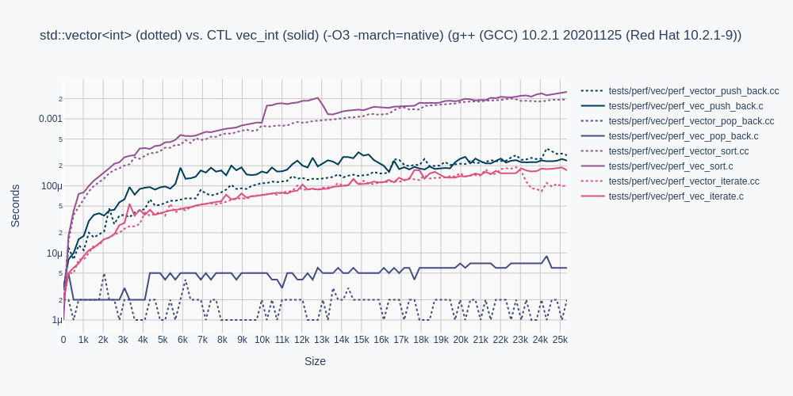
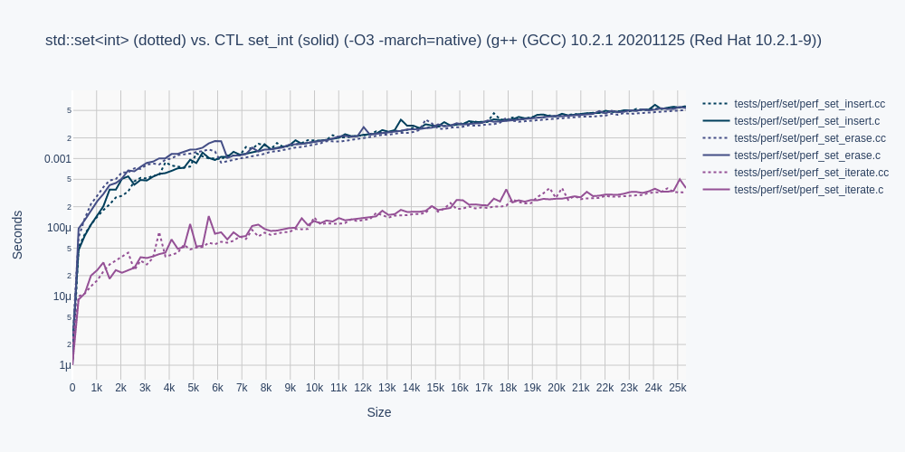
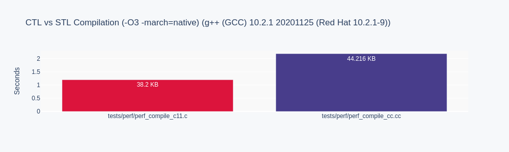

# C CONTAINER TEMPLATE LIBRARY (CTL)

CTL is a fast compiling, type safe, header only, template-like
container library for ISO C99/C11.

## Motivation

CTL aims to improve ISO C99/C11 developer productivity by implementing
the following STL containers in ISO C99/C11:

```
ctl/deque.h          = std::deque           prefix: deq
ctl/list.h           = std::list            prefix: list
ctl/priority_queue.h = std::priority_queue  prefix: pqu
ctl/queue.h          = std::queue           prefix: queue
ctl/set.h            = std::set             prefix: set
ctl/stack.h          = std::stack           prefix: stack
ctl/string.h         = std::string          prefix: str
ctl/vector.h         = std::vector          prefix: vec
```
map and forward_list are in work still.

It is based on glouw's ctl, but with proper names, and using the incpath `ctl/` prefix.

## Use

Configure a CTL container with a built-in or typedef type `T`.

```C
#include <stdio.h>

#define POD
#define T int
#include <ctl/vector.h>

int compare(int* a, int* b) { return *b < *a; }

int main(void)
{
    vec_int a = vec_int_init();
    vec_int_push_back(&a, 9);
    vec_int_push_back(&a, 1);
    vec_int_push_back(&a, 8);
    vec_int_push_back(&a, 3);
    vec_int_push_back(&a, 4);
    vec_int_sort(&a, compare);
    foreach(vec_int, &a, it)
        printf("%d\n", *it.ref);
    vec_int_free(&a);
}
```

Definition `POD` states type `T` is Plain Old Data (POD).

For a much more thorough getting started guide,
see the wiki: https://github.com/rurban/ctl/wiki and
https://github.com/glouw/ctl/wiki for the original sample with three-letter names.

## Memory Ownership

Types with memory ownership require definition `POD` be omitted, and require
function declarations for the C++ equivalent of the destructor and copy constructor,
prior to the inclusion of the container:

```C
typedef struct { ... } type;
void type_free(type*);
type type_copy(type*);
#define T type
#include <ctl/vector.h>
```

Forgetting a declaration will print a human-readable error message:

```shell
tests/test_c11.c:11:11: error: ‘type_free’ undeclared (first use in this function)
   11 | #define T type
```

## Performance

CTL performance is presented in solid colors, and STL in dotted colors,
for template type `T` as type `int` for all measurements.








Omitted from these performance measurements are `queue.h`, `stack.h`, and `string.h`,
as their performance characteristics can be inferred from `deque.h`, and `vector.h`,
respectively.

Note, CTL strings do not support short strings yet.

## Running Tests

To run all functional tests, run:

```shell
make
```

To compile examples, run:

```shell
make examples
```

To generate performance graphs, run:

```shell
sh gen_images.sh
# Graphing requires python3 and the Plotly family of libraries via pip3.
pip install plotly
pip install psutil
pip install kaleido
```

To do all of the above in one step, run:

```shell
./all.sh
```

The full CI suite is run via: (1-2 hrs)
```shell
./ci-all.sh
```

For maintaining CTL, a container templated to type `int` can be
output to `stdout` by running make on the container name with .i, eg:

```shell
make deque.i
make list.i
make priority_queue.i
make queue.i
make set.i
make stack.i
make string.i
make vector.i
```

## Other

STL `std::map` and `std::unordered_set` are in work as unordered hashmap by
default, no extra `std::unordered_map`.
The map hopefully with something like greg7mdp/parallel-hashmap or at least
khash, not chained lists as in the STL.

STL variants of multi-sets and multi-maps will not be implemented because
similar behaviour can be implemented as an amalgamation of a `set` and `list`.
See `tests/func/test_container_composing.cc`

UTF-8 strings and identifiers will be added eventually, Wide, UTF-16 or UTF-32
not. All methods from algorithm, iterator and range are in work, as well as some
type utilities to omit default compare, equal and hash methods.

## Base Implementation Details

    vector.h: See `realloc`.
    deque.h: Paged `realloc`.
    list.h: Doubly linked list.
    set.h: Red black tree.

## Acknowledgements

Thank you `glouw` for the initial three-letter variant https://github.com/glouw/ctl.
Thank you `kully` for the Plotly code, and thank you for the general review.
Thank you `smlckz` for the `foreach` cleanup.
